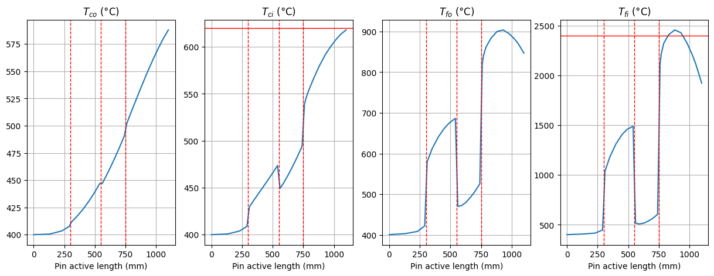
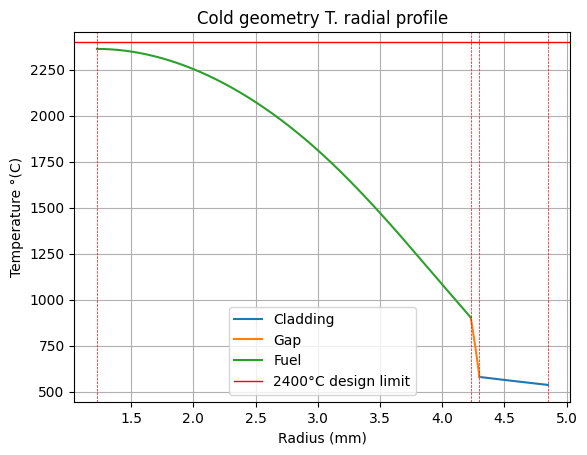
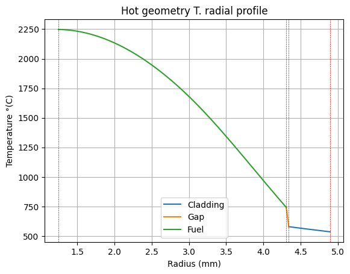
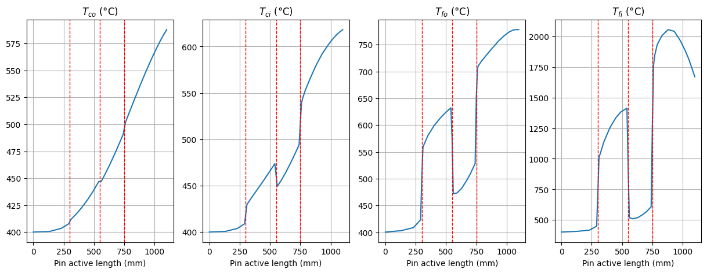
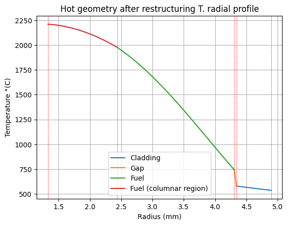
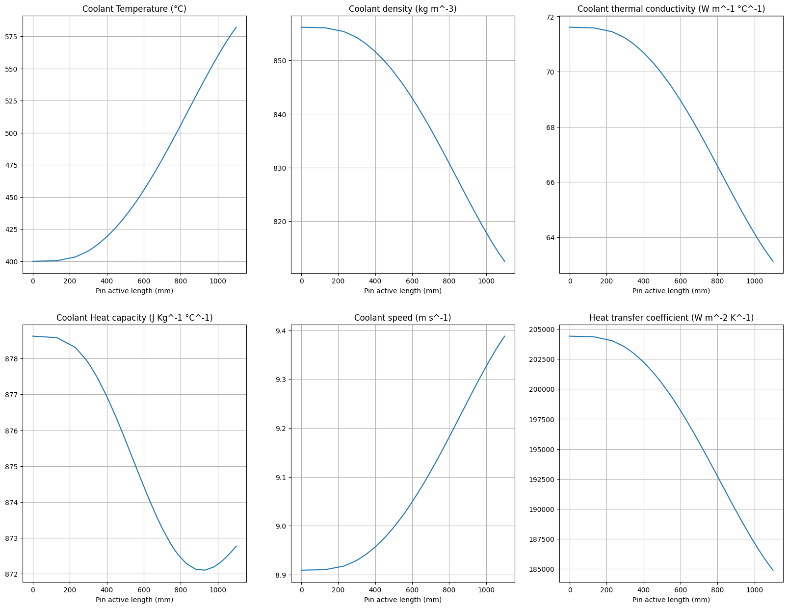

# Results report
It is useful to remember that the aim of this preliminary analysis was the design of:
*   the	thickness	of	the	cladding,
*   the	height	of	the	plena,
*   throttling parameter

while the boundaries to be osserved were the:
*   temperature of	the	cladding,
*   yielding of	the	cladding,
*   creep strain of	the	cladding,
*   margin to	melting of	the	fuel (maximum temperature <2400°C).
*   coolant speed <10 m/s to avoid corrosion
*   total pin length = 2130 mm

**Thickness of the cladding**

First of all, a thickness of the cladding was proposed (**0.55 mm**) and *a posteriori* verified. To do so, the axial temperature profile under different approaches.

1) **cold geometry**: 
it's the temperature profile under the hypothesis that the pin is not deformed in any way. It is hence a rough approximation.

As shown, the cladding midwall temperature limit of 620°C is respected since it is not reached in the hottest point of the whole cladding. The same can't be said about the fuel, since the 2400°C threshold is exceeded at the inner surface of the fuel.
Still, the cold geometry is not a realistic representation but it is only worth displying since it is easy to implement and consists of a first step towards more proper approaches.
Moreover, a less approximate radial analysis of the temperature profile (developed in the axial point with higher inner fuel temperature) shows that, even in cold geometry, the axial analysis overestimates the maximum inner temperature.

2) **hot geometry**: 
this approach accounts for the radial thermal expansion of the cladding and the fuel.

In this framework the maximum temperatures of cladding and fuel are further lowered.

In this case too, the maximum temperature is further lowered.

3) **Fuel restructuring**:
This analysis is not much different from the hot geometry, but accounts for the increased inner fuel radius due to the restructuring of the fuel which entails a lowered inner fuel temperature.

4) **PCI**:
This analysis describes the temperature profile from the moment that cladding and fuel enter in contact due to the swelling of the fuel.

In this analysis the restructuring of the fuel is still accounted for.

**Throttling parameter**

To ensure that the pin was properly cooled, the throtting of the assembly was simply represented by a paramter that amplifies the coolant mass flow rate by incresing its speed by 90%. While this choice lowers the temperature of the cladding, it is important to stress that the upper limit for this amplification is the upper boundary on the coolant speed of 10 m/s to avoid excessive corrosion. As shown in the graphs below, the limit was not exceeded, hence allowing to satisfy both the boundaries on the temperature of the cladding and speed of the coolant.

**Upper and lower plena size**
To establish the length of the lower and upper plena of the pin, the pressure inside the pin must be evaluated at the end of operations must be calculated accounting for the fission gas release for a combination of upper and lower plena length. Then, the boundary of total length of the pin equal to 2130 mm was imposed. The result of this analysis is shown in the heatmap below.

The red dot, which represents the choice of the length of the plena, corresponds to a lower plenum length of 950 mm and 1280 mm upper plenum. Given that the calculation was performed assuming that 90% of the FG are released, which is a conservative choice, the boundary of 5.0 MPa maximum inner pressure is respected.

**Cladding mechanical verification**
At this point, all the design parameters that had to be chosen have been given a value. Still, the compliance with some design limits is yet to be assessed. In particular the creep strain and yielding of the cladding boundaries are yet to be assessed.

So, the first step was ensuring that the stress due to the thermal gradient along the cladding radius and the difference in pressure between outside and inside the cladding was not per se sufficient in yielding it. The components of the thermal and mechanical stresses were calculate and summed component-wise. Then, th equivalent stress was calculated using the Von Mises criterion. The result is displayed in the graphs below.

  
  
  

As shown, the maximum equivalent stress that the cladding undergoes is way below the yielding stress that is one order of magnitude higher.

The same calculation was performed taking into account the contact between cladding and fuel pellet (pellet-cladding interaction, PCI) caused by the irradiation swelling of the latter by evaluating the associated contact pressure. 

This stress values not only exceed the yield stress, but the ultimate tensile strength too; this hints at the fact that the yielding of the cladding allows for the expansion under a stress that can be approximated to the yielding stress. The last asessment performed was based on the calculation of the irradiation creep strain,thermal creep strain and Larson-Miller parameter to make sure that the values of temperature and stress undergone by the cladding were compatible with its time under strain. As a consequence, three limit values for T, $\sigma$ and time under strain were individuated such that if they were to be exceeded, the cladding would have undergone failure during operations. These values were compared with the actual temperature, stress and time under strain of the cladding, which were found to not exceed those limits.

The ratio between failure limits and actual values were:
* Temperature: 

    $\frac{T_{limit}}{T_{actual}} = 1.008 > 1$
 

* time under strain: 

    $\frac{t_{limit}}{t_{actual}} = 4.95 > 1$

* equivalent stress: 

    $\frac{\sigma_{limit}}{\sigma_{actual}} = 1.022 > 1$
